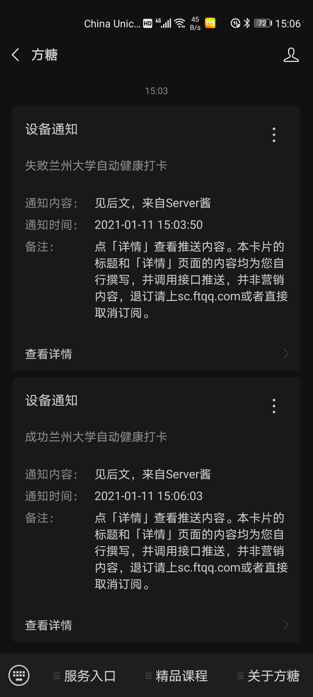
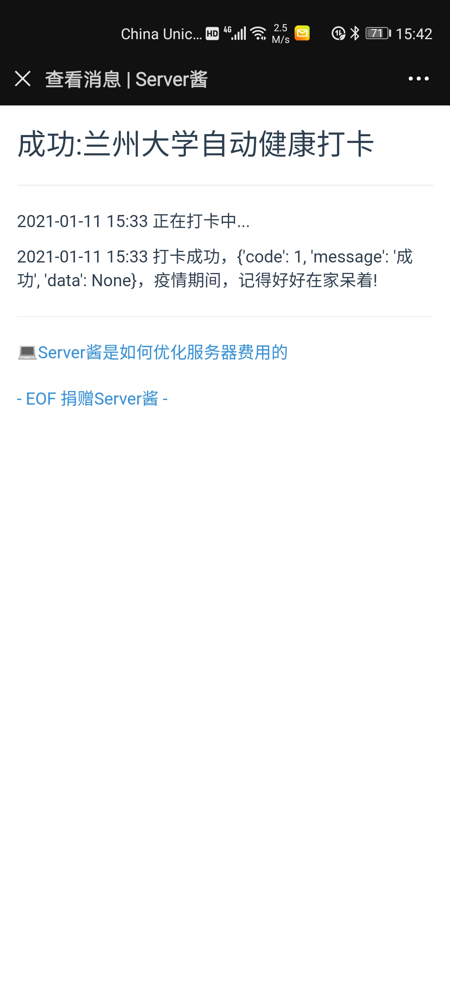

# 兰州大学疫情期间自动定时健康打卡工作流

(English version is down below)

[Python库依赖](../../network/dependencies)

[自动打卡脚本](LZU-Auto-COVID-Health-Report.py)

[工作流](.github/workflows/autoreport.yml)

## 使用方法

（强烈建议你首先自己打一次卡之后再使用本软件，从而初始化平台打卡系统中的数据，本软件将会一直沿用你最新填报的打卡信息。如果需要更改打卡数据，请自己手动在填报平台任意时间段填报一次最新的信息就好）

你可以首先fork本仓库，之后在你fork的仓库中进行相关设置。

1. 首先，按下图所示点击1，2，3的次序，进入新建Actions secrets的界面。我们需要两个Actions secrets，一个的Name为`CARDID`，value为你的兰州大学校园卡号；另一个的Name为`PASSWORD`，value为你的兰州大学个人工作台的账户密码。依次按上述要求创建这两个secrets即可。创建完成后你将在右下部分看到两个Actions secrets。

2. 然后，按下图所示点击1，2，3，4的次序，你可以手动触发工作流的执行来进行测试。（**注意：**：如果因为你多次重复因为账号密码错误登录失败，会导致验证码的出现，此时程序会被阻止自动登录。因而请确保你已经在[兰州大学个人工作台](http://my.lzu.edu.cn:8080/login?service=http://my.lzu.edu.cn)处测试过你的账号密码是正确的。）另外工作流还自动会在北京时间每天的7点，11点，19点自动运行。（因为Github方的原因，可能会有半小时左右的延迟）

3. 点开任意一个运行记录，依次点开下图所示1，2，你可以看到运行记录以及错误说明。

4. 如果某次因为某些因素工作流运行失败，GitHub会自动发邮件提醒工作流运行失败，从而方便自己手动打卡。

5. 将来某一天疫情过去了，不需要再打卡，你可以按下图操作关闭：

## 可选：微信推送打卡结果

这里使用[Server酱](http://sc.ftqq.com/)来实现，它的配置方法请参考其说明文档。

然后，你只需要仿照[使用方法](#使用方法)步骤1，创建一个Name为`SERVERCHANSCKEY`，value为[你的SCKEY调用代码值](http://sc.ftqq.com/?c=code)的Actions secret即可自动让仓库的工作流通过Server酱为你推送自动打卡结果相关信息。

*效果示意*：

推送效果：

点开详情：

## Q&A

1. 怎么查看自己有没有打卡成功？

如果你指的是兰大app里面的健康打卡系统，请把兰大app里面的健康打卡系统中“教职工是否在兰（学生是否在校）”那一栏选中状态取消并手动打一次卡。成功打卡后，打开APP会提示“当日填报完成，如变化请更新！”。

如果你指的是Github Actions里面请直接查看运行记录。workflow运行无报错，则打卡成功。失败Github会站内消息提示workflow运行失败。

当然另外你还可以配置使用[sever酱微信推送](#可选：微信推送打卡结果)。

2. 打卡应用里面没有你给的那个体温选项

返校的时候，如果学校要一日三报，是会有的。

在假期不需要一日三次上报体温，这个功能是为未来返校的时候做的。我的程序会自动判断当前是否在校，如果不在校是不会有体温数据的（都是0.0），另外每次post数据都是要有这一项的。

另外设置的Github Actions是每日三次运行程序，如果你不需要，可以将[这里](
https://github.com/HollowMan6/LZU-Auto-COVID-Health-Report/blob/85427e4d855887ec06fa21721037bed84cb25c54/.github/workflows/autoreport.yml#L6)
更改为`    - cron: '0 23 * * *' # Schedule on CST 7 everyday`，
即每日只在北京时间早上7点运行。

**警告**：

***仅供测试使用，不可用于任何非法用途！***

***对于使用本代码所造成的一切不良后果，本人将不负任何责任！***
# LZU Auto COVID Health Report using Github Action

[Python library dependency](../../network/dependencies)

[Auto Report Script](LZU-Auto-COVID-Health-Report.py)

[Workflow](.github/workflows/autoreport.yml)

## Usage

(It is strongly recommended that you first report your own situation by yourself before using this software so that the system's data can be initialized. This software will always use the data you keep in the system. If you need to change the reporting data, please manually fill in your latest information at any time in the reporting platform.)

You can fork this repository first, and then set related settings in your forked repository.

1. First, click in the order of 1, 2 and 3 as shown in the figure below to enter creating the new actions secrets interface. We need two actions secrets, one name is `CARDID`, value is your student card number of Lanzhou University; the other is `PASSWORD`, value is the account password of your personal workbench of Lanzhou University. Create these two secrets in turn according to the above requirements. After the creation, you will see two actions secrets as in the lower right section.

1. Then, click in the order of 1, 2, 3 and 4 as shown in the figure below. You can manually trigger the execution of workflow to test. (**Note:**: if you repeatedly fail to log in because of the wrong account or password, the program will be prevented from logging in automatically by reCAPTCHA. So please make sure that you can successfully logged into [Lanzhou University personal workbench](http://my.lzu.edu.cn:8080/login?service=http://my.lzu.edu.cn) with your account number and password and that they are correct.) In addition, the workflow will automatically run at 7:00, 11:00 and 19:00 Beijing time every day. (Due to the mechanism realized by Github, there may exist a delay for about half an hour.)

3. Click any running record, and then click in the order of 1 and 2 as shown in the figure below. You can see the running record and error description.

4. If the workflow fails due to some errors, GitHub will automatically send an email to remind the workflow of failure, so on receiving this, you can report by yourself.

5. One day, when the COVID-19 is over, and you don't need to report your health any more. You can disable it according to the following figure:

## Optional: WeChat push results

We Use [Server Chan](http://sc.ftqq.com/) to realize its functionality. For its configuration method, please refer to its documentation (In Chinese).

Then, you just need to follow the [Usage](#使用方法) step 1 to create an Actions Secret whose name is `SERVERCHANSCKEY` and value is [Your SCKEY](http://sc.ftqq.com/?c=code). Then the workflow can automatically push the relevant information of the automatic health reporting results for you.

*Effect Graphs*：

Pushing Effect：

Details：

## Q&A

1. How to check whether you have reported your health successfully?

If you are referring to the health reporting system in the Lanzhou University APP, please cancel the "whether the staff are in Lanzhou (whether the students are in school)" column and then report manually. After successfully reported, again open the app and you will be prompted "当日填报完成，如变化请更新！".

If you are referring to GitHub actions, please check the running record directly. If there is no error in workflow, the reporting is successful. If it fails, GitHub will send a message to prompt workflow to fail.

Of course, you can also configure to use [SeverChan Wechat push] (#optional-wechat-push-results).

2. There is no temperature option you gave in reporting system

When returning to school, if the university still wants to report three times a day, there will be.

You don't need to report your temperature three times a day during the holidays. This function is for the future when you go back to school. My program will automatically determine whether you are currently in school or not. If you are not in school, there will be no valid temperature data (all 0.0). In addition, these items are required for every post data.

And also, GitHub actions is set to run the program three times a day. If you don't need it, you can replace [here](
https://github.com/HollowMan6/LZU-Auto-COVID-Health-Report/blob/85427e4d855887ec06fa21721037bed84cb25c54/.github/workflows/autoreport.yml#L6)
with `    - cron: '0 23 * * *' # Schedule on CST 7 everyday`，
That is, only runs at 7 a.m. Beijing time every day.

**Warning**:

***For TESTING ONLY, not for any ILLEGAL USE!***

***I will not be responsible for any adverse consequences caused by using this code.***
