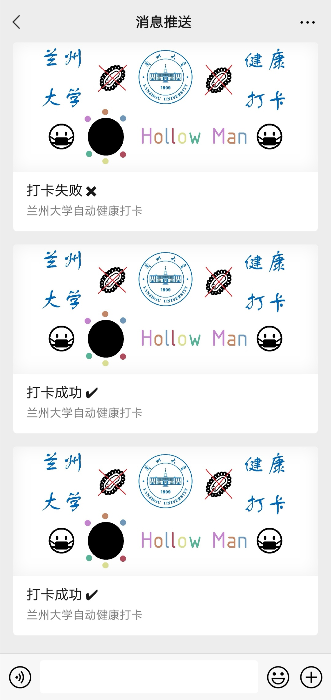
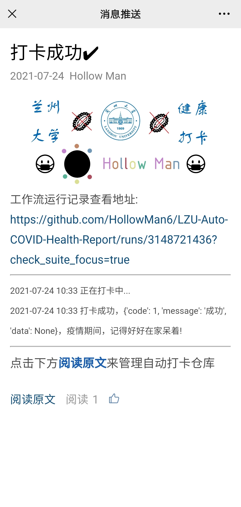

# 兰州大学疫情期间自动定时健康打卡工作流

[](https://hub.docker.com/repository/docker/hollowman6/lzu-auto-covid-health-report)

[](https://github.com/HollowMan6/LZU-Auto-COVID-Health-Report/graphs/commit-activity)
[](https://artifacthub.io/packages/search?repo=lzu-auto-covid-health-report)
[](https://github.com/HollowMan6/LZU-Auto-COVID-Health-Report/releases)


[](https://github.com/HollowMan6?tab=followers)
[](https://github.com/HollowMan6/LZU-Auto-COVID-Health-Report/watchers)
[](https://github.com/HollowMan6/LZU-Auto-COVID-Health-Report/stargazers)
[](https://github.com/HollowMan6/LZU-Auto-COVID-Health-Report/network/members)

[](https://hollowman6.github.io/fund.html)
[](https://opensource.org/licenses/GPL-3.0/)
[](https://github.com/HollowMan6/LZU-Auto-COVID-Health-Report/archive/main.zip)

[](https://lgtm.com/projects/g/HollowMan6/LZU-Auto-COVID-Health-Report/alerts/)
[](https://lgtm.com/projects/g/HollowMan6/LZU-Auto-COVID-Health-Report/context:python)
[](https://lgtm.com/projects/g/HollowMan6/LZU-Auto-COVID-Health-Report/context:javascript)
[](https://microbadger.com/images/hollowman6/lzu-auto-covid-health-report)

(English version is down below)

源GitHub项目地址：https://github.com/HollowMan6/LZU-Auto-COVID-Health-Report

### 好用记得收藏(右上角**加星★Star**)哦!

### 重磅! 新增结合GitHub OAuth App编写的自动打卡工作流管理[网页前端](https://hollowman.ml/LZU-Auto-COVID-Health-Report/)!!! 简单易用，直白明了，免去手动配置的恐惧，十分适合新手，强烈推荐使用! 现已上架GitHub应用商店Marketplace: https://github.com/marketplace/lzu-covid-health-report

[Python库依赖](https://github.com/HollowMan6/LZU-Auto-COVID-Health-Report/network/dependencies)

[自动打卡脚本](LZU-Auto-COVID-Health-Report.py)

[工作流](.github/workflows/autoreport.yml)

全自动打卡，个人信息隐私保护，支持打卡结果推送到社交软件。**新增**支持[将打卡消息推送到浏览器通知](#将打卡消息推送到浏览器通知)，从而实现直接推送到安卓/Linux/Windows/Mac等通知栏处。

支持[Fork本仓库直接使用工作流(推荐)](#使用方法)，[GitLab使用Pipeline](#gitlab)，[自行创建仓库使用工作流](#自行配置工作流)，[CronTab/Python后台定时调度运行](#本地后台运行)，[Docker运行](#docker)，[Kubernetes直接运行](#kubernetes)，[使用Helm包管理在Kubernetes运行](#helm)，[Heroku部署运行](#heroku)等。

[Docker镜像](https://hub.docker.com/r/hollowman6/lzu-auto-covid-health-report)支持在`amd64`、`arm64`、~~`arm32v7`、`arm32v6`~~、`ppc64le`、~~`s390x`~~、`i386`多架构(~~删去~~代表v1.1.2版本后因为cryptography编译问题所以不再支持)(包括大型机、普通PC机以及树莓派等开发板)运行。

## 使用方法

因为大陆网络环境导致图片无法显示的可以前往Gitee查看(下述操作步骤仍然要在GitHub平台上完成哦!)：https://gitee.com/hollowman6/LZU-Auto-COVID-Health-Report#%E4%BD%BF%E7%94%A8%E6%96%B9%E6%B3%95

（强烈建议你首先自己打一次卡之后再使用本软件，从而初始化平台打卡系统中的数据。本软件将会一直沿用你在系统中最新填报的`是否在校`、`所在省市区`、`是否出国`、`出国地点`打卡信息，并会一直上报最健康的状态。）

对于直接在GitHub Actions上使用工作流进行自动打卡，你可以首先fork本仓库，之后在你fork的仓库中进行相关设置。

1. 首先，按下图所示点击1，2，3的次序，进入新建Actions secrets的界面。我们需要两个Actions secrets，一个的Name为`CARDID`，value为你的兰州大学校园卡号(也可接受兰大邮箱账号(不含@lzu.edu.cn后缀))；另一个的Name为`PASSWORD`，value为你的兰州大学个人工作台的账户密码（和你的兰大邮箱密码相同）。依次按上述要求创建这两个secrets即可。创建完成后你将在右下部分看到两个Actions secrets。


2. 然后，按下图所示点击1，2，3，4的次序，你可以手动触发工作流的执行来进行测试。（**注意：** 如果因为你多次重复因为账号密码错误登录失败，很有可能会导致验证码的出现，此时程序会被阻止自动登录。因而请确保你已经在[兰州大学个人工作台](http://my.lzu.edu.cn:8080/login?service=http://my.lzu.edu.cn)处测试过你的账号密码是正确的。）另外工作流还自动会在北京时间每天的~~7点，11点，19点~~7点寒暑假时间(1月，2月，7月，8月)自动运行，并会随机延迟0-20分钟（手动运行时会自动跳过，以节省测试时间）。（另外因为GitHub方的原因，可能会有半小时左右的延迟）（如果工作流没自动在指定时间运行，可能是有上一次手动触发运行失败或被取消导致的，请触发一次正确的运行）


3. 点开任意一个运行记录，依次点开下图所示1，2，你可以看到运行记录以及错误说明。


4. 如果某次因为某些因素工作流运行失败，GitHub会自动发邮件提醒工作流运行失败，从而方便自己手动打卡。

5. 将来某一天疫情过去了，不需要再打卡，你可以按下图操作关闭：


6. **新**：增加可选的遇到打卡失败的情况，自动重启工作流，并等待一段时间后再次自动打卡。如果你需要这个功能，则请创建一个Personal Access Token, [获取教程](https://docs.github.com/cn/github/authenticating-to-github/creating-a-personal-access-token#creating-a-token)(第7步令牌的作用域权限你只需要选中workflow这一栏即可)。然后创建一个Name为`GPATOKEN`，value为你的令牌值的Actions Secret。

默认再次打卡等待时间为30分钟，如果你有需要可以修改你的fork仓库对应的[这里](
https://github.com/HollowMan6/LZU-Auto-COVID-Health-Report/blob/main/.github/workflows/autoreport.yml#L84)的`30m`替换为你想要的数值，这里的时间遵循Linux sleep 函数对应时间语法：一个数字后接 `s` 对应秒, `m` 对应分钟等。

如果是因为本仓库程序本身因为失效而导致的报错，你可以取消正在运行中的工作流从而终止这一循环。

### 可选：微信推送打卡结果

#### PushPlus(推荐)

首先[登录PushPlus](https://www.pushplus.plus/push1.html)，然后在pushplus网站中找到您的token，仿照[使用方法](#使用方法)步骤1，创建一个Name为`PPTOKEN`，value为您的token值的Actions secret，就可以进行一对一推送自动打卡结果相关信息。

如果需要对多个账号推送自动打卡结果相关信息，即一对多推送，还需要另外新建一个群组，记下群组编码，然后创建一个Name为`PPTOPIC`，value为您的群组编码的Actions secret。


#### 企业微信推送 

1. 首先注册[企业微信](https://work.weixin.qq.com/wework_admin/loginpage_wx)。
2. 注册成功后，获取企业id，创建一个Name为`CORPID`，value为您的企业id值的Actions secret。

3. 选择`应用管理` → `应用` → `创建应用`

4. 自己创建完成后获取Secret和AgentId，创建分别Name为`CORPSECRET`和`AGENTID`，value为这些值的Actions secret。

5. 进入`我的企业` → `微信插件`，拉到下边扫描二维码，关注以后即可收到推送的消息。


效果示意:


[示例内容](https://open.work.weixin.qq.com/wwopen/mpnews?mixuin=pHhNDQAABwCobsHiAAAUAA&mfid=WW0324-8tTQjQAABwBCZs6oZBo1yA3mwAO57&idx=0&sn=4f42d0909560e8b42dd756d0ac1b04b6)

### 可选：Server酱，支持企业微信/钉钉/飞书等推送打卡结果

如使用[Server酱](https://sct.ftqq.com/)来实现，它的配置方法请参考其说明文档。

然后，你只需要仿照[使用方法](#使用方法)步骤1，创建一个Name为`SERVERCHANSCKEY`，value为[你的SendKey值](https://sct.ftqq.com/sendkey)的Actions secret即可自动让仓库的工作流通过Server酱为你推送自动打卡结果相关信息。

### 可选：Telegram推送打卡结果

1. [在Telegram中添加`BotFather`这个账号](https://t.me/botfather)，然后向其依次发送`/start` `/newbot`，按照提示设定机器人名字后，即可创建一个属于你自己的全新的机器人。记下该机器人的token(类似于`110201543:AAHdqTcvCH1vGWJxfSeofSAs0K5PALDsaw`):
  


然后创建一个Name为`TGBOTTOKEN`，value为你的token值的Actions secret。

2. 搜索你刚刚创建的机器人的名字，并给它发送`/start`或者任意一条消息。

***特别注意：需要先与机器人之间创建会话，机器人才能下发消息，否则机器人无法主动发送消息，切记！***

3. [在Telegram中搜索`userinfobot`这个账号](https://t.me/userinfobot)，并给它发送`/start`或者任意一条消息，它会返回你的账号的id。然后创建一个Name为`TGCHATID`，value为你的id值的Actions secret。

4. 随后可以测试工作流，一切正常的话你就可以在Telegram上看到自动打卡结果相关信息了。如果你还想将自己的打卡信息推送给其他账号，请在另外的账号上重复步骤2和3，并修改`TGCHATID`，多个ID间使用`,`分隔即可。

## 将打卡消息推送到浏览器通知

你可以从[这里](https://hollowman.ml/Site-Notifications/)获取到订阅码, 随后创建一个 Actions Secret，name为`SUBSINFO`，value为你的订阅码

只需要在[网页前端](https://hollowman.ml/LZU-Auto-COVID-Health-Report/)`Fork仓库操作`处点击`启用浏览器订阅打卡消息`，并且按浏览器提示打开通知权限。

注：

建议选用最新版谷歌Chrome、微软Edge、Mozilla Firefox。

即使网页已经关闭，你将仍然可以收到通知信息。

由于安卓端Chrome、Edge、Firefox浏览器订阅和接收打卡消息时使用FCM(Firebase Cloud Messaging)，所以请确保设备访问谷歌服务通畅，并且通常需要安装好相关谷歌服务才能使用。如点击`启用浏览器订阅打卡消息`后，按钮之后未变为`关闭...`，则除了网络问题，请确保浏览器为谷歌Play商店下载的最新版，其它原因一般为你的ROM版本不支持FCM推送服务，建议安装谷歌框架或者刷国际版ROM之后再试。

华为/荣耀手机如果安装了谷歌框架后还不支持FCM推送服务可以参考[这篇文章](docs/Huawei_Honor_FCM_Fix)

电脑端效果示意:


手机端效果示意:


## GitLab

GitLab仓库地址：https://gitlab.com/HollowMan6/LZU-Auto-COVID-Health-Report

你还可以使用GitLab的Pipeline来进行自动打卡：

同理，fork完GitLab仓库到你的名下后，创建Variables（类似于GitHub Actions Secrets）：


同理，你还可以创建一个Pipeline triggers(类似于Github Access Token)并加入到Variables中来启用自动打开失败再次打卡：


默认再次打卡等待时间为30分钟，如果你有需要可以修改你的fork仓库对应的[这里](.gitlab-ci.yml#L52)的`30m`替换为你想要的数值。

设定schedule：


注：这里的Variables中`DELAYRAND`值可以任意设定，代表使用开始打卡时间随机延迟。不想开始打卡时间随机延迟，可以不设定或者设定为空就好。

## 自行配置工作流

你可以自行创建一个仓库并自行配置工作流进行使用，[示例工作流文件](.github/workflows/autoreport-docker.yml)

### 输入

#### 必须

* CARDID: 兰大校园卡号
* PASSWORD: 兰大邮箱卡号

#### 可选

* DELAYS: 设置打卡时间延迟
* SERVERCHANSCKEY: Server酱 SCKEY
* PPTOKEN: PushPlus Token
* PPTOPIC: PushPlus 群组编码
* TGBOTTOKEN: Telegraph Bot Token
* TGCHATID: Telegram User ID
* CORPID: Wecom Corporation ID
* CORPSECRET: Wecom Corporation App Secret
* AGENTID: Wecom Corporation App Agent ID
* SUBSINFO: 浏览器通知订阅代码

### 示例

```yaml
- name: Auto COVID Health Report
  uses: HollowMan6/LZU-Auto-COVID-Health-Report@main
  with:
    CARDID: ${{ secrets.CARDID }}
    PASSWORD: ${{ secrets.PASSWORD }}
    DELAYS: ${{ github.event.inputs.delays }}
    SERVERCHANSCKEY: ${{ secrets.SERVERCHANSCKEY }}
    PPTOKEN: ${{ secrets.PPTOKEN }}
    PPTOPIC: ${{ secrets.PPTOPIC }}
    TGBOTTOKEN: ${{ secrets.TGBOTTOKEN }}
    TGCHATID: ${{ secrets.TGCHATID }}
    CORPID: ${{ secrets.CORPID }}
    CORPSECRET: ${{ secrets.CORPSECRET }}
    AGENTID: ${{ secrets.AGENTID }}
    SUBSINFO: ${{ secrets.SUBSINFO }}
```

## Docker

Docker Hub 仓库: https://hub.docker.com/r/hollowman6/lzu-auto-covid-health-report

如果你需要通过Docker运行，只需要将上述Actions Secret变量名和值分别设置为环境变量(另外增加一个DELAYS为打卡等待时间，值同[使用方法](#使用方法)步骤6中要求)，然后执行下述命令即可：
```bash
docker run -it \
    -e CARDID=$CARDID \
    -e PASSWORD=$PASSWORD \
    -e DELAYS=$DELAYS \
    -e SERVERCHANSCKEY=$SERVERCHANSCKEY \
    -e PPTOKEN=$PPTOKEN \
    -e PPTOPIC=$PPTOPIC \
    -e TGBOTTOKEN=$TGBOTTOKEN \
    -e TGCHATID=$TGCHATID \
    -e CORPID=$CORPID \
    -e CORPSECRET=$CORPSECRET \
    -e AGENTID=$AGENTID \
    -e SUBSINFO=$SUBSINFO \
    hollowman6/lzu-auto-covid-health-report
```

**创建**

```bash
docker build -t hollowman6/lzu-auto-covid-health-report .
```

该Docker镜像也可以在云服务器中结合Kubernetes的CronJob运行等，可能性无限多。

## Kubernetes

参考配置文件见[K8s](K8s), 只要运行[create.sh](K8s/create.sh)即可创建相关Actions Secret、ConfigMap和CronJob。

你可以[更改这里来设定DELAYS变量](K8s/LZU-Auto-COVID-Health-Report.yml#L6)

还可以[更改这里来设定Cron表达式](K8s/LZU-Auto-COVID-Health-Report.yml#L15)

## Helm

Artifact Hub: https://artifacthub.io/packages/helm/lzu-auto-covid-health-report/lzu-auto-covid-health-report

你可以[参考这里](helmChart/lzu-auto-covid-health-report/values.yaml)来自定义一些values值。
### V3
#### [在线安装脚本(推荐使用)](helmChart/install-online.sh)

脚本会提示你输入相关Secrets，并且会自动创建一个名为`lzu-auto-covid-health-report`的Kubernetes namespace，并将Helm Charts安装在其中。

参考命令：

```bash
kubectl create ns lzu-auto-covid-health-report
helm repo add LZU-Auto-COVID-Health-Report http://hollowman.ml/LZU-Auto-COVID-Health-Report
helm install lzu-auto-covid-health-report LZU-Auto-COVID-Health-Report/lzu-auto-covid-health-report --namespace lzu-auto-covid-health-report --set cardID='[你的校园卡号]' --set password='[你的密码]' --set '[...]'
```

#### 从仓库安装

参考命令：

```bash
kubectl create ns lzu-auto-covid-health-report
cd helmChart/lzu-auto-covid-health-report
helm install lzu-auto-covid-health-report . --namespace wechat-timed-message lzu-auto-covid-health-report --set cardID='[你的校园卡号]' --set password='[你的密码]' --set '[...]'
```

#### 卸载

删除helm chart release:

```bash
helm uninstall lzu-auto-covid-health-report --namespace lzu-auto-covid-health-report
```

删除相关Kubernetes namespace:

```bash
kubectl delete ns lzu-auto-covid-health-report
```

## Heroku

[](https://dashboard.heroku.com/new?template=https://github.com/HollowMan6/LZU-Auto-COVID-Health-Report)

点击以上按钮部署成功后，请确保Overview中Dyno formation栏目中的clock为ON状态，如果不是请开启：


完成后你可以访问应用Web界面手动进行打卡来进行测试，并可以查看手动打卡的日志。

因为Free Dyno 30分钟会自动休眠，实测休眠时不会自动唤醒打卡，因而建议使用付费版，否则不推荐使用。

## 本地后台运行

*注:* 如要在自己的Linux服务器上使用crontab执行定时任务来进行自动打卡，推荐使用[Docker](#docker)。你也可以clone本仓库，安装好相关Python依赖后改编[entrypoint.sh](entrypoint.sh)文件中python程序的路径，将上述Actions Secret变量名和值分别设置为系统环境变量(另外增加一个DELAYS为打卡等待时间，值同[使用方法](#使用方法)步骤6中要求)，即可运行。

你还可以将上述Actions Secret变量名和值分别设置为系统环境变量后，另外增加一个DELAYS为打卡等待时间，值同[使用方法](#使用方法)步骤6中要求，再增加一个CRONEXP为Cron表达式存储定时调度时间，然后后台运行`python clock.py`。这里为了方便使用，我制作了[安装配置shell脚本](install.sh)，你可以直接运行该脚本，输入相关信息后即可在后台定时运行脚本。

[点击这里查看详细教程](docs/CronTab.md)

如果你使用的是Windows，你可以将本仓库切换到[windows分支](../../tree/windows)，然后使用PowerShell运行[`run.ps1`](../../blob/windows/run.ps1)即可。

## Q&A

1. 怎么查看自己有没有打卡成功？

如果你指的是兰大app里面的健康打卡系统，请把兰大app里面的健康打卡系统中“教职工是否在兰（学生是否在校）”那一栏选中状态取消并手动打一次卡。成功打卡后，打开APP会提示“当日填报完成，如变化请更新！”。

如果你指的是GitHub Actions里面请直接查看运行记录。workflow运行无报错，则打卡成功。失败GitHub会站内消息提示workflow运行失败。

当然另外你还可以配置使用[server酱微信推送](#可选微信推送打卡结果)。

2. 打卡应用里面没有你给的那个体温选项

返校的时候，如果学校要一日三报，是会有的。

在假期不需要一日三次上报体温，这个功能是为未来返校的时候做的。我的程序会自动判断当前是否在校，如果不在校是不会有体温数据的（都是0.0），另外每次post数据都是要有这一项的。

另外设置的GitHub Actions是默认暑假期间每日7点自动运行程序，如果你在校，需要每日三次早中晚打卡，可以修改你的fork仓库对应的[这里](
https://github.com/HollowMan6/LZU-Auto-COVID-Health-Report/blob/main/.github/workflows/autoreport.yml#L10)，
更改为`    - cron: '0 23,3,11 * * *' # Schedule on CST 7, 11, 19 everyday`，
即每日在北京时间7，11，19点三次运行。

**警告**：

***仅供测试使用，不可用于任何非法用途！***

***对于使用本代码所造成的一切不良后果，本人将不负任何责任！***
# LZU Auto COVID Health Report using GitHub Action

Source GitHub Repository Link: https://github.com/HollowMan6/LZU-Auto-COVID-Health-Report

### Please **★Star** if you think it's great!

### Breaking News! INTRODUCING New Auto COVID Health Report Workflow Management [Web Front-end](https://hollowman.ml/LZU-Auto-COVID-Health-Report/) build by GitHub OAuth app!!! Easy to use, straightforward, free from the fear of manual configuration, very suitable for novices, strongly recommended! Now it has been published on the GitHub Marketplace: https://github.com/marketplace/lzu-covid-health-report

[Python library dependency](https://github.com/HollowMan6/LZU-Auto-COVID-Health-Report/network/dependencies)

[Auto Report Script](LZU-Auto-COVID-Health-Report.py)

[Workflow](.github/workflows/autoreport.yml)

Fully automatic reporting, privacy protection for personal information, support pushing results to chat APPs. **Newly Added** support to [push report result to browser notification](#push-report-result-to-browser-notification), so to directly push the notification to the notification bar of Android / Linux / Windows / Mac etc.

support [Fork this repository to use workflows(Recommend)](#usage)，[GitLab using Pipeline](#gitlab)，[Self-Configure Workflow](#self-configure-workflow)，[run using CronTab / Python schedule](#run-locally-in-background)，[run with Docker](#docker)，[run with Kubernetes directly](#kubernetes), [Use Helm Package Manager to run in Kubernetes](#helm), [use Heroku to deploy](#heroku) etc.

[Docker Image](https://hub.docker.com/r/hollowman6/lzu-auto-covid-health-report) support running on multiple architectures such as `amd64`, `arm64`, ~~`arm32v7`, `arm32v6`~~, `ppc64le`, ~~`s390x`~~, `i386` (~~Cross out~~ represents chat due to compile issue for cryptography, after v1.1.2 they no longer supported) including Mainframe, PC and Demoboard like Raspberry Pi.

## Usage

(It is strongly recommended that you first report your own situation by yourself before using this software so that the system's data can be initialized. This software will always use the `at university`, `your location`, `whether at abroad`, `abroad location` you kept in the system, and report the healthiest status.)

To auto report with GitHub Actions workflow, you can fork this repository first, and then set related settings in your forked repository.

1. First, click in the order of 1, 2 and 3 as shown in the figure below to enter creating the new actions secrets interface. We need two actions secrets, one name is `CARDID`, value is your student card number of Lanzhou University(or the LZU email account user name(without `@lzu.edu.cn`)); the other is `PASSWORD`, value is the account password of your personal workbench of Lanzhou University(It's the same as your email password). Create these two secrets in turn according to the above requirements. After the creation, you will see two actions secrets as in the lower right section.


1. Then, click in the order of 1, 2, 3 and 4 as shown in the figure below. You can manually trigger the execution of workflow to test. (**Note:** if you repeatedly fail to log in because of the wrong account or password, the program may be likely to be prevented from logging in automatically by reCAPTCHA. So please make sure that you can successfully logged into [Lanzhou University personal workbench](http://my.lzu.edu.cn:8080/login?service=http://my.lzu.edu.cn) with your account number and password and that they are correct.) In addition, the workflow will automatically run at ~~7:00, 11:00 and 19:00~~7:00 Summer/Winter Holiday Time (January, February, July, August) Beijing time every day, and delay for a random time between 0 and 20 minutes (Will Skip this when runned manually, to save test time) (Moreover, due to the mechanism realized by GitHub, there may exist a delay for about half an hour.) (If the workflow does not automatically run at the specified time, it may be caused by the failure or cancellation of the last manual triggered run, please trigger a run manually so that it can run correctly.)


3. Click any running record, and then click in the order of 1 and 2 as shown in the figure below. You can see the running record and error description.


4. If the workflow fails due to some errors, GitHub will automatically send an email to remind the workflow of failure, so on receiving this, you can report by yourself.

5. One day, when the COVID-19 is over, and you don't need to report your health any more. You can disable it according to the following figure:


6. **NEW**: Add the optional option to restart the workflow automatically in case of Auto Report in failure, and wait for a period of time to re-run workflow again automatically. If you need this, please create a Personal Access Token, [Here's Guides to create](https://docs.github.com/en/github/authenticating-to-github/creating-a-personal-access-token#creating-a-token)(In step 7 scopes or permissions, you only need to select the `workflow` row). Then create an Actions Secret with the name of `GPATOKEN` and the value with your token.

The default waiting time is 30 minutes. You can replace `30m` [here](
https://github.com/HollowMan6/LZU-Auto-COVID-Health-Report/blob/main/.github/workflows/autoreport.yml#L84) in your corresponding repository with the time you want. The time here  follows the Linux sleep syntax for time units: a number followed by `s` for seconds, `m` for minutes, etc.

If the error is caused by the repository program itself, you can cancel the running workflow to terminate the loop.

### Optional: WeChat push results

#### PushPlus(Recommended)

First [log into pushplus](https://www.pushplus.plus/push1.html), and then find your token in pushplus website, follow [Usage](#Usage) step 1, create a actions secret with the name of `PPTOKEN` and the value of your token value, and then one-to-one push the related information of automatic reporting results.

If you need to push the related information of automatic reporting results to multiple Wechat accounts, that is, one-to-many push, you need to create a group, write down the group code, and then create an actions secret with the name of `PPTOPIC` and the value of your group code.


#### Wecom push by Wechat 

1. First register [Wecom](https://work.weixin.qq.com/wework_admin/loginpage_wx).
2. After successful registration, obtain the Company ID and create an actions secret with the name of `CORPID` and the value of your Company ID.

3. Select `App Management` → `Apps` → `Create an app`.

1. After the creation, obtain the secret and AgentId, and create actions secret with the name of `CORPSECRET` and `AGENTID` and the value of these values respectively. 

1. Enter `My Company` → `WeChat Workplace`, pull to the bottom and scan the QR code. After following, you can receive the push message.


Demo:


[Example Content](https://open.work.weixin.qq.com/wwopen/mpnews?mixuin=pHhNDQAABwCobsHiAAAUAA&mfid=WW0324-8tTQjQAABwBCZs6oZBo1yA3mwAO57&idx=0&sn=4f42d0909560e8b42dd756d0ac1b04b6)

### Optional: ServerChan, support Enterprise Wechat / Dingtalk / Feishu push results
We Use [Server Chan](https://sct.ftqq.com/) to realize its functionality. For its configuration method, please refer to its documentation (In Chinese).

Then, you just need to follow the [Usage](#Usage) step 1 to create an Actions Secret whose name is `SERVERCHANSCKEY` and value is [Your SendKey](https://sct.ftqq.com/sendkey). Then the workflow can automatically push the relevant information of the automatic health reporting results for you.

### Optional: Telegram push results

1. [Add the `BotFather` account in Telegram](https://t.me/botfather), and then send `/start` `/newbot` in turn. After setting the name of the robot according to the prompts, you can create a brand new robot of your own. Note the token of the robot. (Similar to `110201543:AAHdqTcvCH1vGWJxfSeofSAs0K5PALDsaw`):


Then create an Actions Secret with the name `TGBOTTOKEN` and the value of your token.

2. Search the name of the robot you just created, and send `/start` or any message.

***ATTENTION: you need to chat with the robot first to initialize otherwise the robot won't send any messages to you.***

3. [Add the `userinfobot` account in Telegram](https://t.me/userinfobot), and then send `/start` or any message, and it will return the ID of your account. Then create an actions secret with the name `TGCHATID` and the value of your account ID.

4. Then you can test the workflow. If everything is normal, you can see the relevant information of the automatic reporting result on the telegram. If you want to push your result to another account, please repeat steps 2 and 3 on the other account, and modify `TGCHATID`. Use `,` to separate between IDs.

## Push report result to browser notification

You can get the subscription code from [here](https://hollowman.ml/Site-Notifications/), then create an Actions Secret with name `SUBSINFO` and value your subscription code.

Just click `启用浏览器订阅打卡消息` in the `Fork仓库操作` part of the [Web Front-end](https://hollowman.ml/LZU-Auto-COVID-Health-Report/), and then open the notification permission according to the browser prompt

Note:

If the browser needs to receive notification, it is recommended to select the latest version of Google Chrome, Microsoft edge and Mozilla Firefox.

Even if the web page is closed, you will still be able to receive a notification message.

Because the Chrome, Edge and Firefox for Android browsers uses FCM (firebase Cloud Messaging) to push, you usually need to make sure you can visit Google Service, install relevant Google services before you can use it. For example, after clicking `启用浏览器订阅打卡消息`, the button does not change into `关闭...`, except from network problems, please make sure you download latest version from Google Play Store, otherwise generally it's caused by your ROM version not supporting FCM push service. It is recommended to install Google framework or use the Global ROM version and try again.

If your phone is Huawei or Honor phone and does not support FCM push service after installing Google framework (GMS), please refer to [this video (in Bahasa Indonesia but can just follow gesture)](https://www.youtube.com/watch?v=nLzYrxm0mMg).

Demo in PC:


Demo in Phones:


## GitLab

GitLab Repository Address：https://gitlab.com/HollowMan6/LZU-Auto-COVID-Health-Report

You can also use GitLab's Pipeline to auto-report：

In the same way, after forking the gitlab repository under your account, create Variables（similar to GitHub Actions Secrets）:


In the same way, you can also create a Pipeline triggers (similar to Github Access Token) and add it to Variables to restart the workflow automatically in case of Auto Report in failure：


The default waiting time is 30 minutes. You can replace `30m` [here](.gitlab-ci.yml#L52) in your corresponding repository with the time you want. 

Setup schedule：


Note: the `DELAYRAND` value in the variables here can be set with any value, which represents the random delay of the start reporting time. If you don't want to random delay, you don't need to set it or set it to empty.
## Self-Configure Workflow

You can create your own repository and configure your own workflow to use, [Example Workflow YAML File](.github/workflows/autoreport-docker.yml)

### Input

#### Required

* CARDID: Your Student Card ID
* PASSWORD: Your Student Email Login Password

#### Optional

* DELAYS: Delay time for running
* SERVERCHANSCKEY: ServerChan SCKEY
* PPTOKEN: PushPlus Token
* PPTOPIC: PushPlus Topic
* TGBOTTOKEN: Telegraph Bot Token
* TGCHATID: Telegram User ID
* CORPID: Wecom Corporation ID
* CORPSECRET: Wecom Corporation App Secret
* AGENTID: Wecom Corporation App Agent ID
* SUBSINFO: Browser Notification Subscription Code

### Example

```yaml
- name: Auto COVID Health Report
  uses: HollowMan6/LZU-Auto-COVID-Health-Report@main
  with:
    CARDID: ${{ secrets.CARDID }}
    PASSWORD: ${{ secrets.PASSWORD }}
    DELAYS: ${{ github.event.inputs.delays }}
    SERVERCHANSCKEY: ${{ secrets.SERVERCHANSCKEY }}
    PPTOKEN: ${{ secrets.PPTOKEN }}
    PPTOPIC: ${{ secrets.PPTOPIC }}
    TGBOTTOKEN: ${{ secrets.TGBOTTOKEN }}
    TGCHATID: ${{ secrets.TGCHATID }}
    CORPID: ${{ secrets.CORPID }}
    CORPSECRET: ${{ secrets.CORPSECRET }}
    AGENTID: ${{ secrets.AGENTID }}
    SUBSINFO: ${{ secrets.SUBSINFO }}
```

## Docker

Docker Hub Repository: https://hub.docker.com/r/hollowman6/lzu-auto-covid-health-report

If you need to run through docker, just set the above Actions Secrets name and value as environment variables (In addition, add a DELAYS as the waiting time, and the value is the same requirement as that in step 6 of [usage](#usage)), and then execute the following command:

```bash
docker run -it \
    -e CARDID=$CARDID \
    -e PASSWORD=$PASSWORD \
    -e DELAYS=$DELAYS \
    -e SERVERCHANSCKEY=$SERVERCHANSCKEY \
    -e PPTOKEN=$PPTOKEN \
    -e PPTOPIC=$PPTOPIC \
    -e TGBOTTOKEN=$TGBOTTOKEN \
    -e TGCHATID=$TGCHATID \
    -e CORPID=$CORPID \
    -e CORPSECRET=$CORPSECRET \
    -e AGENTID=$AGENTID \
    -e SUBSINFO=$SUBSINFO \
    hollowman6/lzu-auto-covid-health-report
```

**Build**

```bash
docker build -t hollowman6/lzu-auto-covid-health-report .
```

The docker image here can also be runned in combination with Kubernetes' CronJob in the Cloud Clusters etc. THere're unlimited possibilities.

## Kubernetes

You can refer to the configuration file [K8s](K8s).Also create the relevant Secrets ConfigMap and CronJob by running [create.sh](K8s/create.sh)

You can also [change here to set `DELAYS` Variable](K8s/LZU-Auto-COVID-Health-Report.yml#L6)

Also [change here to set Cron expression](K8s/LZU-Auto-COVID-Health-Report.yml#L15)

## Helm

Artifact Hub: https://artifacthub.io/packages/helm/lzu-auto-covid-health-report/lzu-auto-covid-health-report

### V3
#### [Online Install Script(Recommend)](helmChart/install-online.sh)

The script will prompt users to enter the Secrets, and sutomatically created a Kubernetes namespace called `lzu-auto-covid-health-report`, and install Helm Charts into it.

Example command:

```bash
kubectl create ns lzu-auto-covid-health-report
helm repo add LZU-Auto-COVID-Health-Report http://hollowman.ml/LZU-Auto-COVID-Health-Report
helm install lzu-auto-covid-health-report LZU-Auto-COVID-Health-Report/lzu-auto-covid-health-report --namespace lzu-auto-covid-health-report --set cardID='[Your Password]' --set '[...]'
```

#### From Repository

Example command:

```bash
kubectl create ns lzu-auto-covid-health-report
cd helmChart/lzu-auto-covid-health-report
helm install lzu-auto-covid-health-report . --namespace wechat-timed-message lzu-auto-covid-health-report --set cardID='[Your CardID]' --set password='[Your Password]' --set '`[...]`'
```

#### Uninstall

Delete helm chart release:

```bash
helm uninstall lzu-auto-covid-health-report --namespace lzu-auto-covid-health-report
```

Delete related Kubernetes namespace:

```bash
kubectl delete ns lzu-auto-covid-health-report
```

## Heroku

[](https://dashboard.heroku.com/new?template=https://github.com/HollowMan6/LZU-Auto-COVID-Health-Report) 

After sccessfully deployed the app, please make sure that the clock is ON at Dyno formation part in the Overview Section. If it's not, turn it on:


After that, you can visit the application web interface, report manually to test and view manual report logs.

Because Free Dyno will automatically sleep in 30 minutes, it will not automatically wake up even the specified time arrives when it sleeps, so it is recommended to use the paid Dyno, otherwise is not recommended.

## Run locally in background

*PS:* If you want to use crontab on your own Linux server to execute the auto Health Report, I recommend using [docker](#docker), otherwise please clone this repository and after installing relevant Python dependencies, adapt the path of the python program in [entrypoint.sh](entrypoint.sh). Set the Actions Secrets name and value mentioned above as the environment variable respectively (In addition, add a DELAYS as the waiting time, and the value is the same requirement as that in step 6 of [usage](#usage)) to run.

You can also set the Actions Secrets name and value mentioned above as the environment variable respectively, in addition, add a DELAYS as the waiting time, and the value is the same requirement as that in step 6 of [usage](#usage), and add a CRONEXP as the schedule time, the value being the cron expression. Finally run `python clock.py` in the background. Here, for the convenience of use, I made a [install and configure shell script](install.sh). you can run the script directly, and then the program will run and schedule in the background after inputting relevant information.

If you use Windows, you can switch this repository into [branch `windows`](../../tree/windows), then use PowerShell to run [`run.ps1`](../../blob/windows/run.ps1).

## Q&A

1. How to check whether you have reported your health successfully?

If you are referring to the health reporting system in the Lanzhou University APP, please cancel the "whether the staff are in Lanzhou (whether the students are in school)" column and then report manually. After successfully reported, again open the app and you will be prompted "当日填报完成，如变化请更新！".

If you are referring to GitHub actions, please check the running record directly. If there is no error in workflow, the reporting is successful. If it fails, GitHub will send a message to prompt workflow to fail.

Of course, you can also configure to use [ServerChan Wechat push](#optional-wechat-push-results).

2. There is no temperature option you gave in reporting system

When returning to school, if the university still wants to report three times a day, there will be.

You don't need to report your temperature three times a day during the holidays. This function is for the future when you go back to school. My program will automatically determine whether you are currently in school or not. If you are not in school, there will be no valid temperature data (all 0.0). In addition, these items are required for every post data.

And also, GitHub actions is set to run the program during summer holiday 7 a.m. every day. If you are at university, and you need to report 3 times a day in the morning, noon, evening separately, you can replace [here](
https://github.com/HollowMan6/LZU-Auto-COVID-Health-Report/blob/main/.github/workflows/autoreport.yml#L10) in your corresponding repository 
with `    - cron: '0 23,3,11 * * *' # Schedule on CST 7, 11, 19 everyday`,
That is, runs at 7 a.m., 11 a.m., 7 p.m. three times in Beijing timezone every day.

**Warning**:

***For TESTING ONLY, not for any ILLEGAL USE!***

***I will not be responsible for any adverse consequences caused by using this code.***
