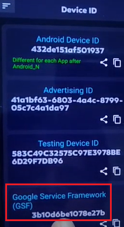
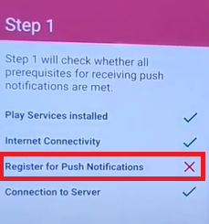
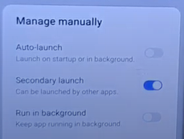
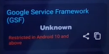
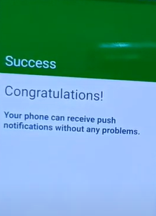

# 最新2021修复安装了谷歌框架GMS后华为/荣耀手机FCM推送服务仍不能用的问题(Microsoft Authenticator微软验证器在安装了Google服务后还是提示不可用)

本人CSDN博文链接: https://blog.csdn.net/qq_18572023/article/details/113994262

## 简介

Firebase Cloud Messaging (FCM) 是 Google Cloud Messaging (GCM) 的升级版，是一种便于在移动应用和服务器应用程序之间进行消息传递的云推送服务。[详细了解](https://docs.microsoft.com/zh-cn/xamarin/android/data-cloud/google-messaging/firebase-cloud-messaging)

目前大部分华为/荣耀手机在安装了谷歌框架GMS后，FCM推送服务仍然处于不可用状态，从而导致[Microsoft Authenticator微软验证器](https://play.google.com/store/apps/details?id=com.azure.authenticator&hl=zh-Hans)提示未安装Google服务。

笔者亲自尝试了[源视频(印度尼西亚语和部分英语)](https://www.youtube.com/watch?v=nLzYrxm0mMg)所述的方法，亲测成功。现在以文字版本呈现给大家。

## 准备

1. 一部已经安装完谷歌框架的华为/荣耀手机。(具体方法不同型号手机可能有区别，请善用搜索引擎进行安装)
2. 可以访问谷歌的上网环境。
3. 安装好[Device ID](https://play.google.com/store/apps/details?id=vtechnotm.com.deviceid&hl=zh-Hans)应用。(若因网络问题，不可以直接安装，请自己百度，从谷歌应用商店下载apk手动安装)
4. 安装好[Push Notification Tester](https://play.google.com/store/apps/details?id=com.firstrowria.pushnotificationtester&hl=zh-Hans)应用。(若因网络问题，不可以直接安装，请自己百度，从谷歌应用商店下载apk手动安装)
5. 将修改版[Google Play Services和Google Play Store](https://drive.google.com/file/d/1--uxC60KA-wJXK2PM1aDdaq3hUpsoxCI/view)文件APK提前下载到手机中。(APK文件由视频上传作者提供) 为方便，这里提供[百度网盘]转存:

```text
链接：https://pan.baidu.com/s/10vQVq8urRzF7AYOOM020fw 
提取码：holo 
```

## 修复步骤

1. 打开[Device ID](https://play.google.com/store/apps/details?id=vtechnotm.com.deviceid&hl=zh-Hans)应用，确认`Google Service Framework(GSF)`可以显示出ID。(若不能显示ID请打开一次Play应用商店之后等一会儿再尝试，若长时间不能显示可能是谷歌框架安装有问题，建议重新安装谷歌框架)



2. 打开[Push Notification Tester](https://play.google.com/store/apps/details?id=com.firstrowria.pushnotificationtester&hl=zh-Hans)应用，点击右下角按钮`Start`开始，等待一会儿后，确认除`Register for Push Notifications`栏目错误(显示❌)外，其余均为绿色的对号。(`如Play Service installed`显示❌，请确保谷歌框架已经正确安装，如果`Connection to Server`显示❌，请确保当前网络环境可以访问谷歌) (如果该页面所有栏目都是绿色的对号，但是还是无法使用FCM服务，则这篇教程不适合你)



3. 打开`设置` -> `应用` -> `应用管理`，点击右上角三个点打开菜单，然后选择`显示系统进程`，在`搜索应用`栏里输入`google`; 找到`Google Play Services`应用，点开后点击`卸载`，在弹出的确认对话框中确认卸载。同理卸载`Google服务框架`应用。卸载后如果通知栏弹出消息不要管它。

4. 依次安装之前下载的修改版的`Google Play Services`(Layanan Google Play  20.47.13 (120400-344095733).apk)和`Google服务框架`(com.google.android.gsf_10-29_minAPI29(nodpi)_apkmirror.com.apk)，如果提示应用签名问题请不要管它，继续安装即可。

5. 安装好后打开`设置` -> `应用` -> `应用启动管理`，点击右上角三个点打开菜单，然后选择`显示系统程序`，在`搜索应用`栏里输入`google`，找到`Google服务框架`应用，点击取消自动管理，然后在弹出手动管理对话框中确保仅第二个`允许关联启动`被启用，其它的都不启用，然后点击`确定`。



6. 如果通知栏中还未提示`此设备未经Play保护机制认证`通知，请手动打开Play商店，确保当前网络环境可以访问谷歌，等待直到手机弹出此提示后，关闭手机的一切网络链接(包括WiFi和移动数据)，然后打开`设置` -> `应用` -> `应用管理`，点击右上角三个点打开菜单，然后选择`显示系统进程`，在`搜索应用`栏里输入`google`，找到`Google服务框架`应用并点击，再依次点击`存储` -> `删除数据`，重启手机。
7. 开机后，立即打开[Device ID](https://play.google.com/store/apps/details?id=vtechnotm.com.deviceid&hl=zh-Hans)应用，确认`Google Service Framework(GSF)`栏处为Unknown。如果不是请确保网络链接已经断开，重复步骤6中删除Google服务框架数据操作。



8. 退出并返回手机桌面，清空手机内存(底部上划，点击垃圾桶标识)。打开Play商店，稍等一会儿，再次打开[Device ID](https://play.google.com/store/apps/details?id=vtechnotm.com.deviceid&hl=zh-Hans)应用，确认`Google Service Framework(GSF)`可以显示出ID。(如果不能显示请重复本步骤，并等待更长时间)

9. 这时恢复网络链接，打开[Push Notification Tester](https://play.google.com/store/apps/details?id=com.firstrowria.pushnotificationtester&hl=zh-Hans)应用，点击右下角按钮`Start`开始，确认四个全是对号(不是则从第2步重新开始，认真阅读每个字确保操作正确。多次尝试还无效则说明本方法不适用于你的手机)之后，继续点击右下角按钮，最终出现绿色界面，并收到了测试APP的通知，则大功告成。(如果测试中途另外出现问题，请确保当前上网环境可以访问谷歌，如果还是有问题请按照该软件提示自行搜索解决办法。)



10. 成功后你可以选择删除[Device ID](https://play.google.com/store/apps/details?id=vtechnotm.com.deviceid&hl=zh-Hans)和[Push Notification Tester](https://play.google.com/store/apps/details?id=com.firstrowria.pushnotificationtester&hl=zh-Hans)应用。


